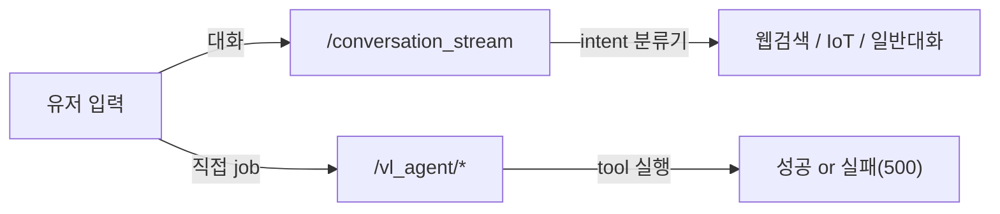
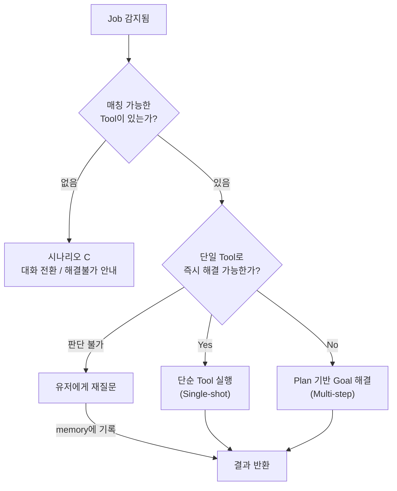
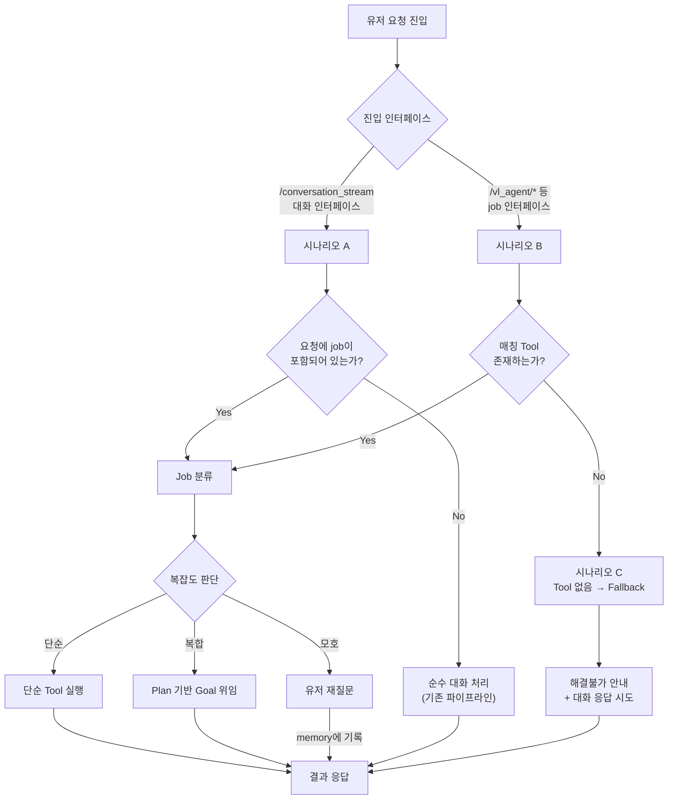

# Plan1: Router 진입 흐름 및 작업 분류 설계

## 1. 현재 아키텍처 문제점

### 현재 진입 경로는 완전히 분리되어 있다



| 경로 | 현재 동작 | 문제 |
|---|---|---|
| `/conversation_stream` | intent 분류기(웹검색, 이미지, IoT, 스몰톡)로 사전 라우팅 후 LLM 대화 생성 | tool calling 구조가 아님. intent가 미리 정해진 것만 분기 가능 |
| `/vl_agent/job` | 직접 grounding 실행 | 해결 못하면 에러 반환. 대화 fallback 없음 |
| `/vl_agent/run` | VL Planner 루프 실행 | job 전용. 대화 맥락 없음 |
| `/vl_agent/engine_stream` | 시나리오 엔진 실행 | 고정 파이프라인. 유연성 없음 |

**핵심 문제**: 대화와 job이 서로 모르는 상태. 대화 중 job을 유연하게 트리거하거나, job 실패 시 대화로 전환할 수 없다.

---

## 2. Router가 다뤄야 할 세 가지 진입 시나리오

### 시나리오 A: 대화 진입 (job 포함 가능)

> 기존 `/conversation_stream` 인터페이스를 통한 진입

유저는 **대화**를 하고 있고, 그 안에서 작업 요청이 포함될 수 있다.

**예시:**
```
유저: "오늘 피곤하다~ 10분 뒤에 알람 좀 맞춰줘"
     → 대화 응답("힘내세요~") + job 실행(알람 설정)

유저: "이 화면에 뭐가 보여?"
     → 대화 응답 + VL 분석 결과

유저: "심심한데 뭐 하지"
     → 순수 대화 (job 없음)
```

**Router의 역할:**
1. 입력을 분석하여 **job이 포함되어 있는지 판단**
2. job이 있으면 → 적절한 tool/agent에 위임 + 대화 응답도 생성
3. job이 없으면 → 기존 대화 파이프라인 그대로 진행

---

### 시나리오 B: job 전용 진입

> `/vl_agent/*` 등 직접 tool calling 인터페이스를 통한 진입

유저(또는 클라이언트)가 **명시적으로 작업만 요청**한다. 대화 컨텍스트 없음.

**예시:**
```
POST /vl_agent/job  {image: ..., query: "화면에서 시작 버튼 찾아줘"}
     → grounding 실행 → 좌표 반환

POST /vl_agent/run  {image: ..., query: "설정 메뉴 열어서 알림 꺼줘"}
     → VL Planner 루프 실행
```

**Router의 역할:**
1. 요청된 job에 **매칭되는 Tool (Primitive) 또는 마크다운 Skill**이 있는지 판단 (온디맨드 로딩 활용)
2. 매칭되면 → 해당 Tool 실행 또는 Skill을 주입하여 Orchestrator 루프 실행
3. **없으면 → 시나리오 C로 전환** (현재는 이상한 tool 사용 또는 무응답)

---

### 시나리오 C: job 진입 → 대화 전환 (Graceful Fallback)

> job으로 진입했지만 tool로 해결할 수 없는 경우

현재 이 케이스가 **처리되지 않는 것**이 핵심 문제다.

**예시:**
```
POST /vl_agent/job  {query: "이 캐릭터 이름이 뭐야?"}
     → grounding으로 해결 불가 (좌표 찾기가 아닌 지식 질문)
     → 현재: 이상한 좌표 반환 or 에러
     → 기대: "이 질문은 tool로 해결할 수 없습니다. 대화로 전환합니다" + 대화 응답

POST /vl_agent/run  {query: "오늘 날씨 알려줘"}
     → 화면 조작이 아닌 일반 질문
     → 현재: 무의미한 grounding 시도
     → 기대: 해결 불가 판단 → 대화 응답 또는 적절한 안내
```

**Router의 역할:**
1. job 요청을 분석했으나 **매칭 tool (Primitive 또는 Skill) 없음** 판단
2. 응답에 `"이 요청은 제공된 도구로 해결할 수 없습니다"` 명시
3. 대화 모드로 fallback하여 단순 텍스트 답변 시도
4. **[절대주의]**: 해결할 수 없는 요청에 대해 "새로운 스킬을 만들어볼까요?" 같은 실시간 제안을 절대 하지 않는다. (환각 루프 방지)

---

## 3. Job 분류: 단순 Tool vs Plan vs 재질문

job이 감지되었을 때, Router는 **작업의 복잡도를 판단**해야 한다.



### 3-1. 단순 Tool 실행 (Single-shot)

> 하나의 tool 호출로 즉시 해결 가능한 작업

**판단 기준:**
- 요청이 **하나의 명확한 동작**에 매핑됨
- 추가 정보 없이 바로 실행 가능
- 중간 판단이나 반복이 필요 없음

**예시:**
| 유저 입력 | 매핑 Tool | 비고 |
|---|---|---|
| "알람 10분 뒤로 맞춰줘" | `alarm_counter` → `make_alarm` | 파라미터 추출 + 실행 |
| "춤 춰봐" | `request_dance` | 직접 실행 |
| "스크린샷 찍어" | `request_screenshot` | 직접 실행 |
| "이 화면에서 시작 버튼 어디야?" | `vl_grounding` | 단일 좌표 탐색 |
| "이 문제 풀어줘" (이미지 포함) | `solve_problem` | 단발 VL 분석 |

### 3-2. Plan 기반 Goal 해결 (Multi-step)

> 여러 단계의 관찰-판단-행동 루프가 필요한 작업

**판단 기준:**
- 요청이 **최종 목표(Goal)**를 제시하지만, 도달 경로가 여러 단계임
- 중간에 화면 관찰, 판단, 클릭 등 **반복적 행동**이 필요
- 단일 tool로는 부분만 해결됨

**예시:**
| 유저 입력 | 위임 대상 | 비고 |
|---|---|---|
| "설정에서 알림 꺼줘" | VL Planner (`/vl_agent/run`) | 화면 탐색 → 클릭 → 확인 반복 |
| "스토리 읽어줘" | Scenario Engine (`engine_stream`) | BAReader 시나리오 루프 |
| "이 게임 스킵해줘" | Scenario Engine (`engine_stream`) | BASkip 시나리오 루프 |

### 3-3. 유저 재질문 (Clarification)

> Router가 판단하기에 정보가 부족하여 유저에게 되물어야 하는 경우

**판단 기준:**
- 요청이 **모호**하거나 여러 tool에 매핑 가능
- 필수 파라미터가 누락됨
- job인지 대화인지 자체가 불분명

**예시:**
| 유저 입력 | 재질문 | 비고 |
|---|---|---|
| "알람 맞춰줘" | "몇 분 뒤로 설정할까요?" | 시간 파라미터 누락 |
| "저거 눌러줘" | "어떤 것을 눌러야 할지 알려주세요" | 대상(target) 불분명 |
| "해줘" | "무엇을 해드릴까요?" | 요청 자체가 불명확 |

**Stateless 제약:**
- Router는 재질문을 `memory`(대화 내역)에 남길 수 있음
- 다음 요청 시 memory를 통해 이전 맥락 참조 가능
- 그러나 **재질문 중이라는 상태(state)는 보관하지 못함** → 다음 요청은 독립적으로 처리됨
- 따라서 재질문 응답이 돌아왔을 때, memory에서 이전 질문 맥락을 읽어 이어가는 구조 필요

---

## 4. 통합 흐름도



---

## 5. 미결 사항 / 다음 단계

> 아래 항목들은 다음 Plan에서 구체화가 필요합니다.

### 설계 결정 필요
- [ ] **Job 감지 방법**: 시나리오 A에서 대화 속 job을 어떻게 감지할 것인가?
  - 현재 intent 분류기 확장? LLM 기반 function calling 도입? 키워드 매칭?
- [ ] **Tool 매칭 방법**: 유저 요청을 어떤 기준으로 어떤 tool에 매핑할 것인가?
  - tool description 기반 LLM 판단? 분류기? 규칙 기반?
- [ ] **복잡도 판단 기준**: 단순 tool vs plan 기반의 경계를 누가/어떻게 판단하는가?
- [ ] **시나리오 C의 응답 수준**: 대화 fallback 시 어디까지 답변을 시도할 것인가?
  - 단순 안내 메시지? LLM 대화 응답까지?

### 인터페이스 결정 필요
- [ ] **Router를 단일 엔드포인트로 통합**할 것인가, 기존 엔드포인트 구조를 유지하면서 내부에 Router 레이어만 추가할 것인가?
- [ ] **응답 포맷 통일**: 대화 응답과 job 결과를 하나의 포맷으로 합칠 것인가?
