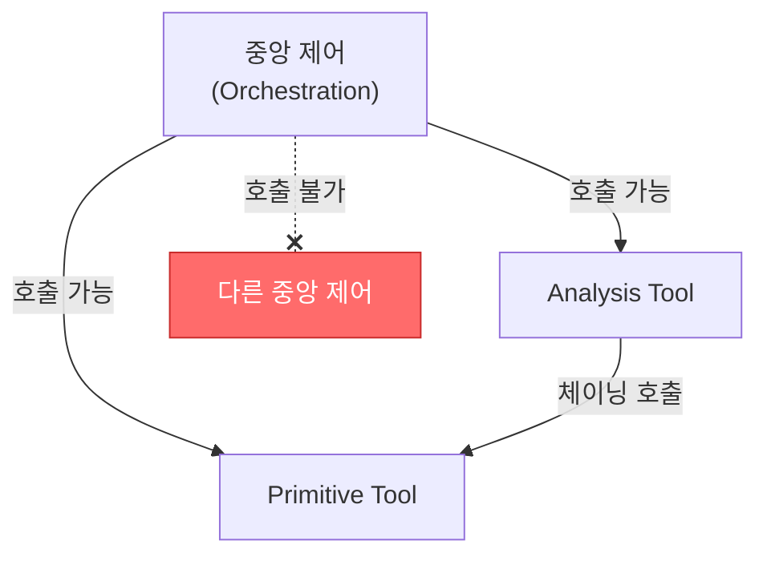
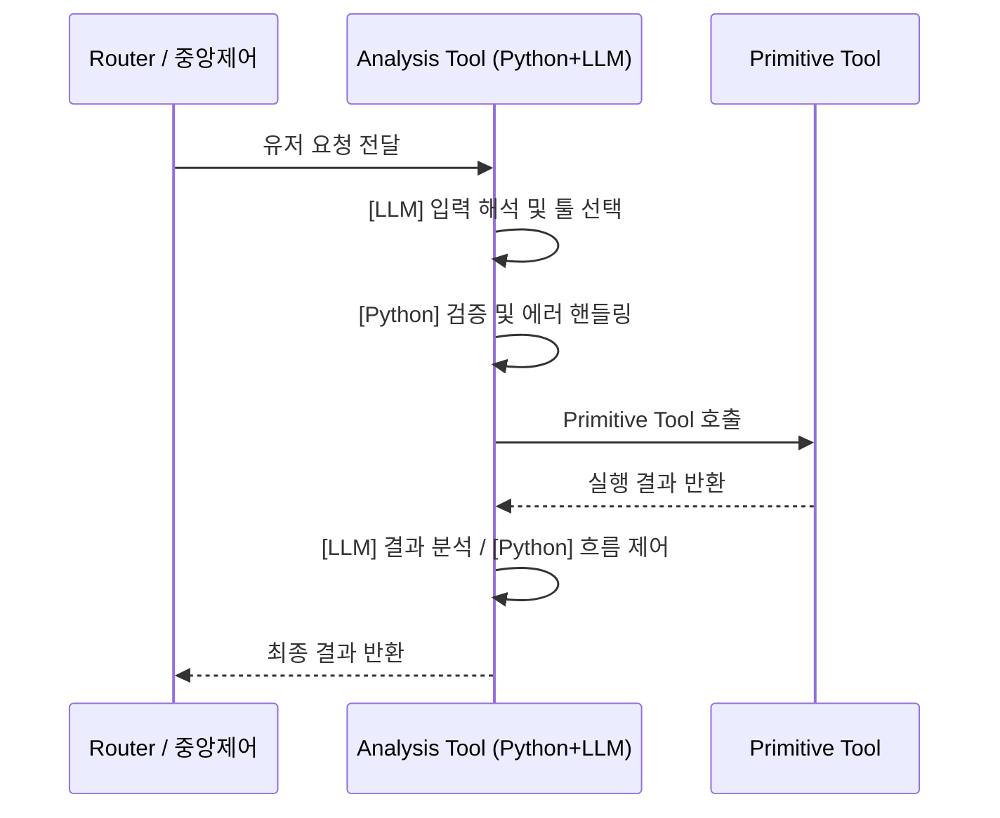
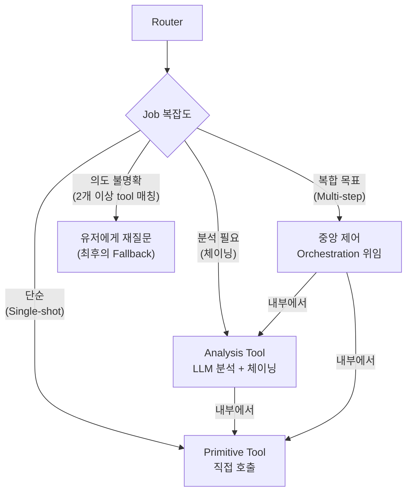

# Plan2: Tool 분류 체계

## 1. 분류 기준

Tool은 두 개의 축으로 분류한다.

### 축 1: 실행 위치 (어디서 실행되는가)

| 실행 위치 | 설명 | 특성 |
|---|---|---|
| **Python 내부** | 서버에서 바로 실행, 결과 즉시 반환 | 동기적. 네트워크 불필요 |
| **Unity 클라이언트** | 클라이언트에 요청을 보내고 응답 대기 | 비동기적. 네트워크 왕복 필요 |
| **중앙 제어** | 다른 tool들을 조합하여 목표를 달성하는 상위 실행 환경 | 제약: 아래 참고 |

### 축 2: 기능 유형 (무엇을 하는가)

| 기능 유형 | 설명 | 예시 |
|---|---|---|
| **Primitive Tool** | 단일 목적의 원자적 동작. 스스로 완결됨 | `alarm_setting`, `request_click`, `vl_grounding` |
| **Analysis Tool** | 파이썬 래퍼(Wrapper). 내부에 LLM 호출을 포함하며, 파이썬 코드의 안정적인 에러 핸들링과 LLM의 자율적 분석 능력을 결합한 체이닝 도구 | `analysis_alarm`, `analysis_grounding` |
| **Orchestration** | 여러 tool을 루프로 조합하여 복합 목표를 달성하는 제어 프레임워크 | VL Planner, Scenario Engine |

---

## 2. 중앙 제어 (Orchestration) 제약사항

> 중앙 제어는 이 대화와 같다. 하나의 세션에서 한 번만 실행된다.

| 제약 | 설명 |
|---|---|
| **단일 호출** | 세션당 한 번만 호출됨. 하나의 요청에 대해 하나의 중앙 제어만 동작 |
| **중첩 금지** | 중앙 제어가 다른 중앙 제어를 호출할 수 없음 |
| **하위 tool만 호출** | Primitive Tool과 Analysis Tool만 호출 가능 |
| **하드웨어 적응** | 컴퓨터 수준에 맞는 중앙 제어 전략을 사용 (상세는 추후 설계) |



---

## 3. Analysis Tool 동작 패턴

Analysis Tool은 단순 파서가 아니다. **파이썬 함수 형태의 래퍼(Wrapper)로 존재하며, 그 내부에 작은 LLM 호출을 포함하여 파이썬의 하드코딩적 흐름 제어(에러 체크 등)와 LLM의 자율적 분석(결과 해석) 능력을 완벽히 결합**한 체이닝 도구다.

### 동작 흐름 예시

```
유저: "10분 뒤에 알람 맞춰줘"

1. Router → analysis_alarm 호출 (Python 함수)
2. analysis_alarm 내부 동작:
   - [LLM] "10분 뒤" 해석 → 현재 06:01이니까 06:11
   - [LLM] 판단: alarm_setting을 호출해야겠다 결정
   - [Python] 에러 체크 및 검증 후 `alarm_setting(time="06:11")` 호출
3. alarm_setting 실행 → 결과 반환
4. analysis_alarm → 최종 결과 정리하여 반환
```



### Analysis Tool의 구성 요소

각 `analysis_*.py`는 다음을 포함한다:

| 구성 요소 | 설명 |
|---|---|
| **프롬프트 템플릿** | LLM에게 분석 방향을 지시하는 시스템 프롬프트 |
| **입력 스키마** | 이전 tool 결과 또는 유저 요청의 형식 |
| **출력 스키마** | 분석 결과 + 다음 호출할 tool 정보 |
| **호출 가능 tool 목록** | 이 analysis tool이 체이닝할 수 있는 primitive tool 리스트 |

---

## 4. Tool 분류표

### Python 내부 실행 — Primitive

| Tool | 기능 | 입력 | 출력 | 위험도 |
|---|---|---|---|---|
| `alarm_counter` | 알람 시간 오프셋 추출 (JSON) | 자연어 텍스트 | 시간 오프셋 JSON | 🟢 없음 (조회) |
| `alarm_setting` | 알람 실제 설정 | 시간 정보 | 설정 완료 결과 | 🟡 상태 변경 |
| `vl_grounding` | 화면에서 대상 좌표 탐색 | 이미지 + 대상 텍스트 | 좌표 JSON | 🟢 없음 (조회) |
| `vl_keyword_detect` | UI 키워드 존재 여부 탐지 | 이미지 + 키워드 | 존재 여부 | 🟢 없음 (조회) |
| `vl_prompt_call` | 커스텀 프롬프트로 VL 모델 단발 호출 | 이미지 + 프롬프트 | VL 응답 텍스트 | 🟢 없음 (조회) |
| `solve_problem` | 이미지 속 문제 풀이 | 이미지 + 프롬프트 | 풀이 텍스트 | 🟢 없음 (조회) |
| `web_search` | 웹 검색 수행 | 검색 키워드 | 검색 결과 | 🟢 없음 (조회) |

### Python 내부 실행 — Analysis

| Tool | 기능 | 체이닝 대상 | 비고 |
|---|---|---|---|
| `analysis_alarm` | 알람 요청 해석 → 시간 계산 → 알람 설정 호출 | `alarm_counter`, `alarm_setting` | 자연어 → 시간 → 실행 |
| `analysis_grounding` | 좌표 결과 해석 → 클릭 판단 | `vl_grounding`, `request_click` | 좌표 → 의미 → 행동 |
| `analysis_screen` | 화면 분석 → 상황 판단 → 다음 행동 결정 | `vl_prompt_call`, `vl_keyword_detect` | 범용 화면 해석 |
| *(확장 가능)* | ... | ... | 패턴에 따라 추가 |

### Unity 클라이언트 요청 — Primitive

| Tool | 기능 | 입력 | 출력 | 위험도 |
|---|---|---|---|---|
| `request_frame` | 새 화면 캡처 요청 | (없음) | 이미지 | 🟢 없음 (조회) |
| `request_click` | 지정 좌표 클릭 수행 | 좌표 (x, y) | 실행 완료 | 🔴 직접 조작 |
| `request_screenshot` | 전체 스크린샷 저장 | (없음) | 이미지 파일 | 🟢 없음 (조회) |
| `request_dance` | 캐릭터 댄스 | (없음) | 실행 완료 | 🟢 없음 (연출) |
| `play_sfx_alert` | 알림 음성 재생 | (없음) | 실행 완료 | 🟢 없음 (연출) |

### 중앙 제어 — Orchestration

| Tool | 기능 | 사용 tool | 제약 |
|---|---|---|---|
| VL Planner | 목표 달성을 위한 관찰-판단-행동 루프 | `request_frame`, `vl_grounding`, `request_click` 등 | 세션당 1회. 중첩 불가 |
| Scenario Engine | 고정 시나리오 파이프라인 (BAReader, BASkip) | `request_frame`, `vl_prompt_call`, `request_click`, TTS | 세션당 1회. 중첩 불가 |
| *(하드웨어 적응형 추가 가능)* | ... | ... | ... |

---

## 5. Plan1과의 연결: Router의 Tool 선택 흐름

Plan1에서 정의한 Job 분류와 이 Tool 분류를 연결하면:



### 재질문 시나리오 (Fallback)

재질문은 **tool이 2개 이상 매칭되어 의도 구분이 안 될 때만** 발생한다.

```
유저: "알람 맞춰줘"

Router 판단:
  - alarm_counter (시간 계산) → 가능
  - alarm_setting (알람 기동) → 가능
  - 의도가 불명확 → 유저에게 질문

Router 응답: "알람 시간을 설정할까요, 아니면 기존 알람을 켤까요?"
```

이것은 tool calling 체인에서 해결이 불가능한 경우의 **최종 fallback**이다. 일반적으로는 Analysis Tool 내부에서 LLM이 판단하여 적절한 tool을 선택한다.

---

## 6. 미결 사항 / 다음 단계

### Plan3에서 다룰 내용
- [ ] **Skill/Rule CRUD 시스템**: 유니티·파이썬에서 로컬 CRUD로 skill/rule을 생성·읽기하는 tool 설계
- [ ] **Analysis Tool이 Skill/Rule을 참조하여 판단**하는 패턴

### 추가 설계 필요
- [ ] **Analysis Tool 프롬프트 템플릿 표준화**: 입출력 스키마, 호출 가능 tool 목록의 정의 방식
- [ ] **하드웨어 적응형 중앙 제어**: 저사양/고사양별 Orchestration 전략 구체화
- [ ] **Tool 등록 체계**: 새로운 tool 추가 시 Router가 자동으로 인식하는 구조
