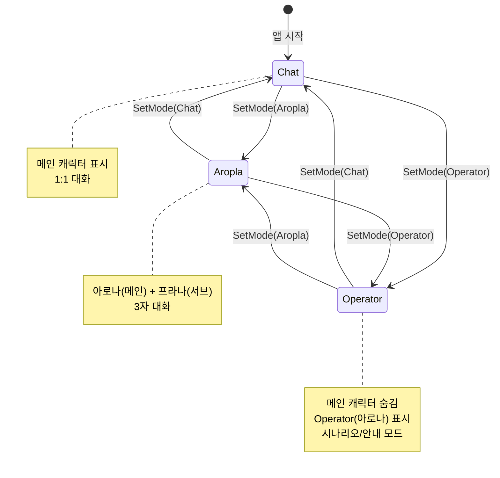

# ChatMode 시스템 구현 계획

## 개요
현재 시스템에는 여러 모드가 흩어져 있습니다:
- **기본 대화 모드**: 메인 캐릭터와 1:1 대화
- **Aropla 모드**: 아로나 + 프라나 3자 대화 (`APIAroPlaManager.ToggleAroplaMode()`)
- **Operator 모드 (신규)**: 메인 캐릭터 숨기고, Operator(아로나)가 메인이 되는 모드

이를 `ChatMode.cs`로 통합 관리하여 일관된 모드 전환 인터페이스를 제공합니다.

---

## 현재 코드 구조 분석

### 1. Aropla 모드 전환 패턴 (참조용)
```csharp
// APIAroPlaManager.cs
public void StartAroplaChannel()
{
    isAroplaMode = true;
    previousCharCode = 현재캐릭터저장;
    CharManager.Instance.ChangeCharacterFromCharCode("arona");  // 메인을 아로나로
    ShowAroplaChannelUI();  // 프라나 서브캐릭터 생성
    StartInitialGreeting();
}

public void StopAroplaChannel()
{
    isAroplaMode = false;
    HideAroplaChannelUI();  // 프라나 제거
    CharManager.Instance.ChangeCharacterFromCharCode(previousCharCode);  // 원래 캐릭터 복원
}
```

### 2. Operator 표시 로직 (현재)
```csharp
// ScenarioUtil.cs - 현재 캐릭터가 arona가 아닐 때
OperatorManager.Instance.ShowPortrait(dialogue);  // Operator UI 표시
PortraitBalloonSimpleManager.Instance.Show();
PortraitBalloonSimpleManager.Instance.ModifyText(dialogue);
```

### 3. 관련 매니저들
| 매니저 | 역할 |
|--------|------|
| `CharManager` | 메인 캐릭터 관리 (표시/교체) |
| `SubCharManager` | 서브 캐릭터 관리 |
| `OperatorManager` | Operator Portrait UI 관리 |
| `APIAroPlaManager` | Aropla 채널 모드 관리 |
| `StatusManager` | 전역 상태 플래그 관리 |

---

## 설계: ChatMode Enum & Manager

### ChatMode Enum 정의
```csharp
public enum ChatMode
{
    Chat,      // 기본: 메인 캐릭터 1:1 대화
    Aropla,    // 아로나+프라나 3자 대화
    Operator   // Operator(아로나)만 표시, 메인 캐릭터 숨김
}
```

### ChatModeManager.cs 구조
```csharp
public class ChatModeManager : MonoBehaviour
{
    public static ChatModeManager Instance { get; private set; }
    
    public ChatMode CurrentMode { get; private set; } = ChatMode.Chat;
    
    // 모드 전환 전 캐릭터 저장 (복원용)
    private string savedCharCode;
    
    public void SetMode(ChatMode newMode);
    public void ToggleMode(ChatMode targetMode);  // 토글 (이미 해당 모드면 Chat으로)
    
    // 내부 메서드
    private void EnterChatMode();
    private void EnterAroplaMode();
    private void EnterOperatorMode();
    private void ExitCurrentMode();
}
```

---

## Operator 모드 상세 설계

### 모드 진입 시
1. **현재 캐릭터 저장**: `savedCharCode = 현재캐릭터코드`
2. **메인 캐릭터 숨기기**: `CharManager.Instance.GetCurrentCharacter().SetActive(false)` 
3. **Operator 표시**: `OperatorManager.Instance.ShowPortrait("")` (대화 없이 표시만)
4. **입력 대상 변경**: 채팅 입력이 Operator로 전달되도록 설정

### 모드 종료 시
1. **Operator 숨기기**: `OperatorManager.Instance.HidePortrait()`
2. **메인 캐릭터 복원**: `CharManager.Instance.GetCurrentCharacter().SetActive(true)`
3. **이전 캐릭터 복원** (필요시): `CharManager.Instance.ChangeCharacterFromCharCode(savedCharCode)`

### Operator 모드 대화 흐름
```
[사용자 입력] 
    → OperatorManager에서 대화 표시/음성 재생
    → PortraitBalloonSimpleManager로 말풍선 표시
```

> [!IMPORTANT]
> Operator 모드에서 AI 응답 처리를 위해 `APIManager` 또는 별도 API 핸들러가 Operator를 대상으로 동작해야 합니다.

---

## 구현 파일 목록

### [NEW] `ChatModeManager.cs`
- `ChatMode` enum 정의
- 모드 전환 로직 통합
- 싱글톤 패턴

### [MODIFY] `MenuTrigger.cs`
- 기존 `APIAroPlaManager.Instance.ToggleAroplaMode()` 호출을
- `ChatModeManager.Instance.SetMode(ChatMode.Aropla)` 또는 `ToggleMode()`로 변경
- Operator 모드 메뉴 항목 추가

### [MODIFY] `StatusManager.cs` (선택)
- `CurrentChatMode` 상태 플래그 추가 가능
- 또는 `ChatModeManager`에서 직접 관리

### [MODIFY] `APIManager.cs` (선택)
- 현재 모드에 따라 응답 대상(캐릭터 vs Operator) 분기

---

## 모드 전환 흐름도



---

## 검증 계획

### 수동 테스트
1. **Chat → Operator 전환**
   - 메인 캐릭터가 숨겨지는지 확인
   - Operator Portrait가 표시되는지 확인
   - 대화 입력이 Operator로 전달되는지 확인

2. **Operator → Chat 전환**
   - Operator가 숨겨지는지 확인
   - 이전 메인 캐릭터가 복원되는지 확인

3. **Chat ↔ Aropla 전환**
   - 기존 기능 유지 확인

4. **모드 간 직접 전환** (Aropla ↔ Operator)
   - 중간에 Chat을 거치지 않고 전환 가능한지

---

## 추가 고려사항

> [!NOTE]
> - Operator 모드에서 TTS는 `SubVoiceManager` 사용 (ScenarioUtil.cs 참조)
> - 말풍선은 `PortraitBalloonSimpleManager` 사용
> - Operator 캐릭터는 현재 **아로나 고정** (`OperatorManager.currentOperator`)

> [!WARNING]
> - `APIAroPlaManager`의 기존 `isAroplaMode` 플래그와 `ChatModeManager`의 상태가 동기화되어야 함
> - 기존 `ToggleAroplaMode()` 호출 부분을 모두 마이그레이션해야 함

---

## 우선순위

1. **Phase 1**: `ChatModeManager.cs` 생성 + Chat/Operator 전환 구현
2. **Phase 2**: 기존 Aropla 로직을 `ChatModeManager`로 통합
3. **Phase 3**: `MenuTrigger.cs` 메뉴 항목 통합
