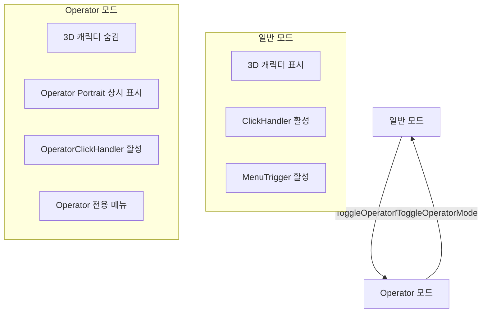

# OperatorMode 구현 계획

## 개요

**OperatorMode**는 기존 3D 캐릭터(GameObject) 대신 2D UI(Image + Masking)를 사용하여 화면 점유율을 줄이면서도 동일한 상호작용 기능을 제공하는 모드입니다.

### 현재 상태
- **기존 Operator** (`OperatorManager.cs`): 메인 캐릭터가 arona가 아닐 때 **시나리오 안내용**으로 좌상단에 잠깐 등장
- **기능**: `ShowPortrait(dialogue)` → 대사 표시 후 자동 숨김 (일시적)

### 목표 (OperatorMode)
- Operator가 **메인 UI**로 동작 (3D 캐릭터 숨김)
- 3D 캐릭터가 가진 모든 상호작용 기능 지원:
  - **좌클릭**: 채팅 시작 (`ChatBalloonManager.ToggleChatBalloon()`)
  - **우클릭/롱프레스**: 컨텍스트 메뉴 표시 (`TriggerMenu()`)
  - **더블클릭**: 메뉴 표시
- **기존 코드 수정 없이** 별도 `OperatorModeManager.cs`로 구현

---

## 현재 상호작용 패턴 분석

### ClickHandler.cs (3D 캐릭터용)
```csharp
// 좌클릭 → 채팅 시작
private void HandleLeftClick() {
    ChatBalloonManager.Instance.characterTransform = this.transform.parent.GetComponent<RectTransform>();
    ChatBalloonManager.Instance.ToggleChatBalloon();
}
```

### MenuTrigger.cs (3D 캐릭터용)
```csharp
// 우클릭 → 메뉴 표시
public void OnPointerDown(PointerEventData eventData) {
    if (eventData.button == PointerEventData.InputButton.Right) {
        TriggerMenu();
    }
}

// 0.5초 롱프레스 → 메뉴 표시
if (leftClickHoldTime >= 0.5f) {
    TriggerMenu();
}
```

### OperatorManager.cs (현재)
| 기능 | 설명 |
|------|------|
| `ShowPortrait(dialogue)` | 애니메이션과 함께 Portrait 표시 + 대사 |
| `HidePortrait()` | Portrait 숨기기 |
| `SetHideTimer(delay)` | 일정 시간 후 자동 숨김 |
| `portraitTransform` | 2D UI (RectTransform) |
| `currentOperator` | 현재 오퍼레이터 GameObject (아로나 고정) |

---

## 설계: OperatorModeManager

### 새로운 파일: `OperatorModeManager.cs`

```csharp
public class OperatorModeManager : MonoBehaviour
{
    public static OperatorModeManager Instance { get; private set; }
    
    // 모드 상태
    public bool IsOperatorMode { get; private set; } = false;
    
    // 복원용 저장
    private string savedCharCode;
    private Vector3 savedCharPosition;
    
    // 핵심 메서드
    public void EnterOperatorMode();   // 모드 진입
    public void ExitOperatorMode();    // 모드 종료
    public void ToggleOperatorMode();  // 토글
    
    // 내부 핸들러 (기존 코드 수정 없이 이벤트 연결)
    private void SetupOperatorInteraction();    // 클릭 핸들러 설정
    private void RemoveOperatorInteraction();   // 핸들러 제거
}
```

### 모드 진입 흐름 (`EnterOperatorMode`)

```
1. savedCharCode = 현재 캐릭터 코드 저장
2. 메인 캐릭터 숨기기 (SetActive(false))
3. Operator Portrait 상시 표시 (타이머 없이)
   → OperatorManager.ShowPortraitPermanent() 또는 직접 제어
4. Operator에 클릭 핸들러 연결
   → IPointerClickHandler 구현한 별도 컴포넌트 추가
5. StatusManager 플래그 설정 (if needed)
```

### 모드 종료 흐름 (`ExitOperatorMode`)

```
1. Operator 핸들러 제거
2. Operator Portrait 숨기기
3. 메인 캐릭터 복원 (SetActive(true))
4. 이전 캐릭터로 복원 (if changed)
```

---

## 구현 파일 목록

### [NEW] `OperatorModeManager.cs`
- 모드 진입/종료 로직
- 캐릭터 저장/복원
- Operator UI를 메인으로 전환

### [NEW] `OperatorClickHandler.cs`
- `OperatorManager.portraitTransform`에 부착할 클릭 핸들러
- `IPointerClickHandler`, `IPointerDownHandler`, `IPointerUpHandler` 구현
- 기존 `ClickHandler.cs` + `MenuTrigger.cs`의 핵심 로직 복제
  - 좌클릭 → 채팅 시작
  - 우클릭/롱프레스 → 메뉴 표시
  - 더블클릭 → 메뉴 표시

### [MODIFY NONE] 기존 코드 수정 없음
- `OperatorManager.cs` 수정 없음
- `ClickHandler.cs` 수정 없음
- `MenuTrigger.cs` 수정 없음

---

## 클릭 핸들러 상세 설계

### OperatorClickHandler.cs

```csharp
public class OperatorClickHandler : MonoBehaviour, 
    IPointerClickHandler, IPointerDownHandler, IPointerUpHandler
{
    // 롱프레스 감지
    private bool isLeftClickHeld = false;
    private float leftClickHoldTime = 0f;
    private const float longPressThreshold = 0.5f;
    
    // 더블클릭 감지
    private float lastClickTime = 0f;
    private int clickCount = 0;
    private const float doubleClickTime = 0.3f;
    
    // 좌클릭 처리 (ClickHandler.HandleLeftClick 참조)
    private void HandleLeftClick() {
        // ChatBalloon 위치를 Operator로 설정
        ChatBalloonManager.Instance.characterTransform = 
            OperatorManager.Instance.portraitTransform;
        ChatBalloonManager.Instance.ToggleChatBalloon();
    }
    
    // 메뉴 표시 (MenuTrigger.TriggerMenu는 직접 호출 불가 → 새로 구현 필요)
    private void TriggerOperatorMenu() {
        // ContextMenu 직접 참조하여 메뉴 구성
        // 또는 별도 OperatorMenuTrigger 사용
    }
}
```

> [!IMPORTANT]
> **메뉴 문제**: `MenuTrigger.TriggerMenu()`가 private이고 특정 캐릭터 컨텍스트에 의존함.
> - **옵션 1**: `TriggerMenu()`를 public static으로 분리
> - **옵션 2**: `OperatorMenuTrigger.cs`에서 메뉴 로직 복제
> - **옵션 3**: Operator 전용 간소화된 메뉴 구성
> 
> **권장**: 옵션 3 - Operator 모드에서는 필요한 메뉴만 표시 (Settings, Chat, Exit 등)

---

## Operator Portrait 상시 표시 처리

현재 `OperatorManager.ShowPortrait()`는 자동 숨김 타이머와 함께 동작합니다. 
OperatorMode에서는 상시 표시가 필요합니다.

### 접근 방법
1. **직접 제어** (OperatorModeManager에서):
   ```csharp
   // 강제 표시
   OperatorManager.Instance.portraitTransform.gameObject.SetActive(true);
   OperatorManager.Instance.portraitTransform.localScale = Vector3.one;
   
   // 숨김 타이머 무효화
   if (OperatorManager.Instance.hideCoroutine != null)
       OperatorManager.Instance.StopCoroutine(hideCoroutine);
   ```

2. **플래그 추가 (OperatorManager 수정 필요시)**:
   ```csharp
   // OperatorManager에 추가 (수정 최소화)
   public bool isPermanentMode = false;
   ```

> [!NOTE]
> 기존 코드 수정 금지 조건으로 **옵션 1 (직접 제어)** 사용 예정.
> 단, `hideCoroutine`이 private이므로 접근이 어려움 → 대안 필요.

### 대안: Operator Portrait 직접 제어
- `OperatorModeManager`가 Operator의 `portraitTransform`을 직접 활성화/비활성화
- `OperatorManager`의 기존 메서드 호출 대신 직접 Transform 조작

---

## 상호작용 대상 변경

### 채팅 입력 시 응답 대상
- **Chat 모드**: 메인 캐릭터 (`CharManager.Instance.GetCurrentCharacter()`)
- **Operator 모드**: Operator (아로나)

### 구현
`APIManager`에서 현재 모드 확인 후 응답 대상 결정:
```csharp
// 응답 표시 시
if (OperatorModeManager.Instance.IsOperatorMode) {
    // PortraitBalloonSimpleManager로 표시
    PortraitBalloonSimpleManager.Instance.ModifyText(response);
} else {
    // AnswerBalloonManager로 표시 (기존 로직)
}
```

> [!WARNING]
> 이 부분은 `APIManager.cs` 수정이 필요할 수 있음. 
> 대안: Operator 모드 전용 API 호출 경로 구현.

---

## 흐름도



---

## 메뉴 진입점 추가

`MenuTrigger.cs`에 Operator 모드 전환 메뉴 추가 (선택적):

```csharp
// Experiment 서브메뉴에 추가
("Operator Mode", delegate {
    OperatorModeManager.Instance.ToggleOperatorMode();
    string status = OperatorModeManager.Instance.IsOperatorMode ? "활성화" : "비활성화";
    Debug.Log($"Operator 모드 {status}");
})
```

---

## 검증 계획

### 수동 테스트
1. **모드 진입 테스트**
   - 메뉴에서 Operator Mode 선택
   - 3D 캐릭터가 숨겨지는지 확인
   - Operator Portrait가 상시 표시되는지 확인

2. **클릭 상호작용 테스트**
   - Operator 좌클릭 → 채팅 입력창 표시 확인
   - Operator 우클릭 → 컨텍스트 메뉴 표시 확인
   - Operator 롱프레스(0.5초+) → 메뉴 표시 확인
   - Operator 더블클릭 → 메뉴 표시 확인

3. **채팅 기능 테스트**
   - Operator 모드에서 채팅 입력 후 전송
   - 응답이 Portrait 말풍선에 표시되는지 확인

4. **모드 종료 테스트**
   - Operator 모드에서 다시 토글
   - 3D 캐릭터가 복원되는지 확인
   - 이전 캐릭터가 올바르게 복원되는지 확인

---

## 구현 우선순위

1. **Phase 1**: `OperatorModeManager.cs` 기본 구조
   - 모드 상태 관리
   - 캐릭터 숨기기/복원
   - Operator Portrait 상시 표시

2. **Phase 2**: `OperatorClickHandler.cs`
   - 좌클릭 → 채팅 시작
   - 우클릭 → 간소화된 메뉴

3. **Phase 3**: 메뉴 통합
   - Operator 모드 전환 메뉴 항목 추가

---

## 확정 사항 (2026-01-08)

1. **메뉴 구성**: 기존 MenuTrigger와 동일한 전체 메뉴 복제 ✓
2. **응답 처리**: `APIManager` 그대로 사용, ChatBalloon 표시 동일 ✓
3. **TTS 출력**: `VoiceManager` 사용 ✓
4. **말풍선**: `PortraitBalloonSimpleManager` 사용 ✓
