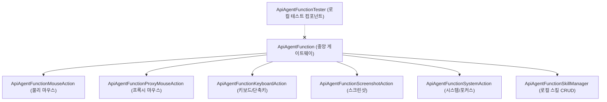

# 유니티 클라이언트 AI 에이전트 기능(ApiAgentFunction) 설계서

본 문서는 AI 에이전트가 유니티 클라이언트 상에서 목표 달성을 위해 수행하는 행동(Click, Scroll, Drag, Type, Hotkey, Screenshot, Skill CRUD 등)을 체계적으로 분리하고, 유저의 조작을 방해하지 않는 비침습적 프록시 조작 기술을 구현하기 위한 **유니티 클라이언트 파트 아키텍처 설계도**입니다.

---

## 1. 아키텍처 설계 철학 및 규칙

### 1-1. 완전한 모듈화 (Single Responsibility Principle)
기존에 `ApiVlAgentManager`, `ApiVlEngineManager`, `ApiVlPlannerManager`에 파편화 및 중복 구현되어 있던 UI 제어, 마우스 조작, 캡처 로직을 기능별로 완전히 분리합니다. 모든 기능 클래스는 `ApiAgentFunction`을 접두사로 사용합니다.

### 1-2. 비침습 우선 및 물리 폴백 (Non-Intrusive First, Physical Fallback)
* **프록시 액션 우선**: 유저의 마우스 커서 점유를 뺏지 않는 비침습적 조작(`ProxyMouseAction`)을 기본으로 시도합니다.
* **물리 액션 폴백**: 보안 프로그램 등으로 인해 프록시 조작이 무시되거나 적용되지 않는 환경인 경우, 실제 커서를 이동시키는 물리 조작(`MouseAction`)으로 폴백합니다. 이 조작 우선순위와 폴백 룰은 마크다운 스킬(`SKILL.md`)에 정의되어 LLM이 자율적으로 판단합니다.

### 1-3. 로컬 테스트 및 통신 분리
서버와의 연동 타이밍은 기능의 로컬 완성도를 검증한 뒤 결정합니다. 본 설계는 서버 통신을 배제하고 유니티 클라이언트 내에서 독자적으로 모든 동작을 테스트하고 검증하는 로컬 테스트 스크립트(`ApiAgentFunctionTester`) 설계를 포함합니다.

---

## 2. 모듈별 상세 설계 (Class 명세)



---

### 2-1. ApiAgentFunction (중앙 컨트롤러)
* **역할**: 외부 및 내부(테스터)로부터 들어오는 기능 실행 요청을 파싱하고 적절한 하위 모듈로 라우팅하는 단일 진입점입니다.
* **핵심 API**:
  ```csharp
  public class ApiAgentFunction : MonoBehaviour
  {
      public static ApiAgentFunction Instance { get; }
      
      // 단일 기능 실행 명령 라우팅
      public void ExecuteAction(string functionName, Dictionary<string, object> parameters, Action<bool, string> onComplete);
  }
  ```

---

### 2-2. ApiAgentFunctionMouseAction (물리 마우스 액션)
* **역할**: Win32 API를 사용하여 실제 시스템의 마우스 포인터를 움직이고 클릭/드래그/스크롤을 수행합니다. (커서 점유 O)
* **주요 기술**: Win32 `SetCursorPos`, `mouse_event` DLL Import
* **핵심 API**:
  ```csharp
  public class ApiAgentFunctionMouseAction : MonoBehaviour
  {
      public void PhysicalClick(int winX, int winY, bool isMouseMove = true);
      public void PhysicalDrag(int startX, int startY, int endX, int endY, float duration);
      public void PhysicalScroll(int winX, int winY, int scrollAmount);
  }
  ```

---

### 2-3. ApiAgentFunctionProxyMouseAction (비침습 프록시 마우스 액션)
* **역할**: 유저의 실제 마우스 커서를 움직이지 않고 백그라운드에서 특정 좌표에 클릭/드래그/스크롤 이벤트를 주입합니다. (커서 점유 X)
* **동작 원리 (WindowFromPoint 기반 동적 해상)**:
  1. 화면의 절대 좌표 `(x, y)` 정보를 확보합니다.
  2. Win32 API `WindowFromPoint(POINT)`를 호출하여 해당 좌표 바로 아래에 위치한 윈도우 핸들(`HWND`)을 실시간으로 가져옵니다.
  3. `ScreenToClient(HWND, ref POINT)`를 통해 절대 좌표를 해당 윈도우의 내부 상대 좌표로 변환합니다.
  4. `PostMessage(HWND, Msg, wParam, lParam)`를 사용하여 `WM_LBUTTONDOWN`, `WM_LBUTTONUP`, `WM_MOUSEMOVE`, `WM_MOUSEWHEEL` 메시지를 대상 윈도우에 직접 송신합니다.
* **핵심 API**:
  ```csharp
  public class ApiAgentFunctionProxyMouseAction : MonoBehaviour
  {
      public bool ProxyClick(int winX, int winY);
      public bool ProxyDrag(int startX, int startY, int endX, int endY, float duration);
      public bool ProxyScroll(int winX, int winY, int scrollAmount);
  }
  ```

---

### 2-4. ApiAgentFunctionKeyboardAction (키보드 및 단축키 액션)
* **역할**: 문자열 자동 타이핑 및 단축키 제어를 수행합니다. 마우스 액션과 연동하여 정밀한 폼 입력 자동화를 가능하게 합니다.
* **주요 기술**: Win32 `keybd_event` 또는 `SendInput` DLL Import
* **핵심 API**:
  ```csharp
  public class ApiAgentFunctionKeyboardAction : MonoBehaviour
  {
      public void TypeText(string text);
      public void SendHotkey(string modifier, string key); // 예: "Ctrl", "C" / "Alt", "Tab"
  }
  ```

---

### 2-5. ApiAgentFunctionScreenshotAction (스크린샷 액션)
* **역할**: 화면 전체 또는 특정 지정 영역을 캡처하고, 로컬 디스크 저장 및 시스템 클립보드 이식을 담당합니다.
* **핵심 API**:
  ```csharp
  public class ApiAgentFunctionScreenshotAction : MonoBehaviour
  {
      public void CaptureScreen(Action<byte[]> onCaptured);
      public void CaptureAndSave(string path);
      public void CopyScreenshotToClipboard(string imagePath);
  }
  ```

---

### 2-6. ApiAgentFunctionSystemAction (시스템 제어 액션)
* **역할**: 윈도우 창 활성화(Focus), 프로세스 우선순위 조정 등 시스템 윈도우 레벨의 부가 작업을 수행합니다.
* **핵심 API**:
  ```csharp
  public class ApiAgentFunctionSystemAction : MonoBehaviour
  {
      public void FocusWindow(string windowTitle);
  }
  ```

---

### 2-7. ApiAgentFunctionSkillManager (로컬 스킬 CRUD 매니저)
* **역할**: 유니티 로컬 저장소인 `Application.persistentDataPath` 내부의 `skills` 폴더에서 스킬 Markdown 파일(`.md`)들을 CRUD(생성, 읽기, 수정, 삭제)하고 관리합니다.
* **동작 규칙**:
  * **저장 위치**: `Application.persistentDataPath/skills/` (구동 시 폴더가 없으면 자동 생성)
  * **파일명 = Key**: 파일 이름 자체가 고유의 툴 명칭 및 기능 키가 됩니다. (예: `우편함_수령_스킬.md` -> `우편함_수령_스킬`이라는 툴이 됨)
  * **YAML Frontmatter 파싱**: 마크다운 파일 상단의 YAML 형식 메타데이터를 파싱하여 스킬명, 설명, 트리거 단어들을 유기적으로 관리합니다.
* **핵심 API**:
  ```csharp
  public class ApiAgentFunctionSkillManager : MonoBehaviour
  {
      // 스킬 저장 (생성 및 수정)
      public void SaveSkill(string skillKey, string frontmatterJson, string bodyMarkdown);
      
      // 단일 스킬 읽기
      public string ReadSkillBody(string skillKey);
      
      // 전체 스킬 목록 및 메타데이터 가져오기
      public List<SkillMetadata> GetAllSkills();
      
      // 스킬 삭제
      public void DeleteSkill(string skillKey);
  }
  
  [System.Serializable]
  public class SkillMetadata
  {
      public string key;
      public string name;
      public string description;
      public List<string> triggers;
  }
  ```

---

## 3. 로컬 테스트 및 검증 시나리오 (ApiAgentFunctionTester)

완성도 높은 로컬 기능 동작 보장을 위해, 에디터 및 빌드 환경에서 마우스와 파일 입출력 동작을 독립 검증할 수 있는 **테스트 UI 및 시나리오 검증 컴포넌트**를 개발합니다.

### 3-1. 테스터 기능 명세
* **유니티 인게임 GUI 제공**: 화면 한쪽에 ImGui 또는 Unity UI Canvas를 배치하여, 마우스 좌표 지정, 타이핑 텍스트 입력, 스킬 파일명을 기입할 수 있는 입력 폼을 제공합니다.
* **단발성 툴 실행 검증**:
  * `[Proxy Click]` 버튼 클릭 시, 마우스 커서는 그대로 두고 타겟 유니티 버튼이 실제로 작동하는지(Click Event Trigger) 검증합니다.
  * `[Physical Click]` 버튼 클릭 시, 실제 윈도우 마우스 커서가 물리적으로 움직여 클릭이 이루어지는지 검증합니다.
  * `[Type text]` 버튼 클릭 시, 활성화된 입력 창에 정해진 텍스트가 타이핑되는지 확인합니다.
* **로컬 스킬 CRUD 검증**:
  * `[Save Test Skill]` 버튼 클릭 시, 임시 스킬 마크다운 파일이 `Application.persistentDataPath/skills/test_skill.md` 경로에 정상 생성되는지 검증합니다.
  * 생성된 마크다운 파일을 로컬에서 열어 YAML Frontmatter와 본문 텍스트의 정합성을 수동으로 크로스체크합니다.

---

## 4. 미결 사항 및 다음 단계

### 4-1. 구현 우선순위
1. **`ApiAgentFunctionSkillManager.cs`** 구현 및 로컬 파일 I/O 검증
2. **`ApiAgentFunctionMouseAction.cs`** 및 **`ApiAgentFunctionProxyMouseAction.cs`**의 마우스 제어 구현 (Win32 DLL Import 적용)
3. **`ApiAgentFunctionKeyboardAction.cs`**, **`ApiAgentFunctionScreenshotAction.cs`**, **`ApiAgentFunctionSystemAction.cs`** 구현
4. **`ApiAgentFunctionTester.cs`**를 통한 기능별 물리/프록시 및 IO 동작 로컬 테스트 진행

### 4-2. 추후 아키텍처 연동 과제
* **스킬 기반 폴백 룰 통합**: 스킬 내부에 프록시 마우스 조작과 물리 마우스 조작의 우선순위를 명문화하고, 이를 판단할 중앙 에이전트의 프롬프트와 연동하는 실증 테스트 필요.
* **이벤트 기반 통신 인터페이스 구성**: 로컬 기능 완비 이후, 기존 매니저들의 API 스트림 상에서 서버 요청 발생 시 스킬 매니저를 통해 로컬 마크다운 파일을 즉각 송출하는 연동 로직 적용.
