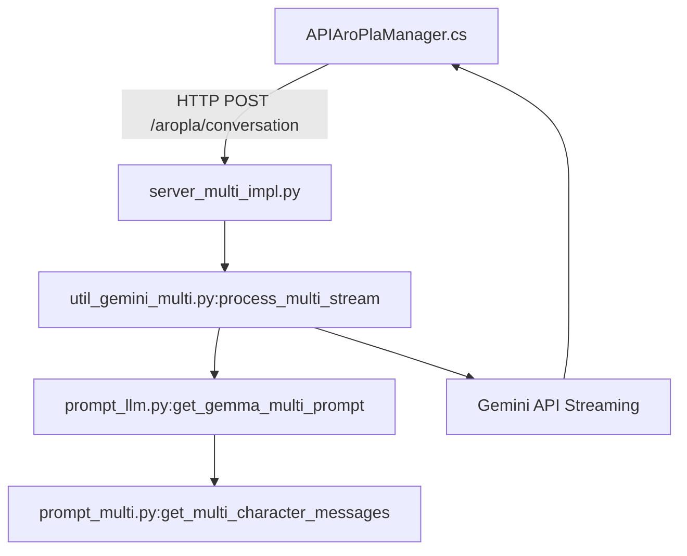

# ApiGeminiMulti 마이그레이션 계획

## 개요
Python 서버 (`server/multi_conversation_asis`)에서 처리하던 다중 캐릭터 대화 로직을 Unity C#에서 직접 Gemini API를 호출하는 방식으로 마이그레이션합니다.

## 현재 서버 아키텍처 분석

### 호출 흐름


### 핵심 서버 모듈 분석

| 모듈 | 역할 | 마이그레이션 대상 |
|------|------|------------------|
| `server_multi_impl.py` | Flask 엔드포인트, 요청 파싱, 응답 스트리밍 | 불필요 (Unity에서 직접 처리) |
| `util_gemini_multi.py` | Gemini API 호출, 스트리밍 처리, 후처리 | → `ApiGeminiMultiClient.cs` |
| `prompt_llm.py:get_gemma_multi_prompt` | Gemma 형식 프롬프트 조립 | → `ApiGeminiMultiPromptBuilder.cs` |
| `prompt_multi.py:get_multi_character_messages` | 다중 캐릭터 메시지 리스트 생성 | → `ApiGeminiMultiPromptBuilder.cs` |
| `prompt_char.py` | 캐릭터 JSON → 마크다운 변환 | 재활용: `ApiGeminiCharacterDataManager.cs` |
| `util_translator.py` | 번역 처리 | 재활용: `ApiGeminiTranslator.cs` |

---

## 기존 재활용 가능 C# 컴포넌트

### 1. `ApiGeminiDirectClient.cs`
- **재활용 항목**:
  - `ApplyStoppingStrings()` - Stop strings 처리
  - `GetPunctuationSentences()` - 문장 분리 로직
  - `RemoveThinkTag()` - `<think>` 태그 제거
  - `TryExtractChunkTextFromJson()` - SSE JSON 파싱
  - `StopStrings[]` 배열
- **용도**: 스트리밍 응답 처리 시 문장 분리, stop string 적용

### 2. `ApiGeminiPromptBuilder.cs`
- **재활용 항목**:
  - `AddGemmaTurn()` - Gemma 턴 포맷 헬퍼
  - `GetMainPrompt()` / `GetMainPrompt2()` - 기본 시스템 프롬프트 (언어별)
  - `GetCharacterInfo()` - 캐릭터 프로필 조회
  - `GetPlayerPersona()` - 유저 프로필 조회
  - `GetConversationGuideline()` - 가이드라인 처리
  - `GetCommonKnowledge()` - 공통 지식
- **용도**: 기본 프롬프트 구조 참조 (단, Multi용은 별도 구현)

### 3. `ApiGeminiTranslator.cs`
- **재활용 가능**: 번역 프롬프트, API 호출 로직
- **용도**: 다국어 응답 생성 시 번역 처리 (필요시)

### 4. `ApiGeminiCharacterDataManager.cs`
- **완전 재활용**: `GetCharacterPrompt()` 함수
- **용도**: 캐릭터별 마크다운 프롬프트 조회

### 5. `ApiKei.cs` (추정)
- **재활용**: `GetValidatedGeminiKey()`, `GetNextGeminiKey()`
- **용도**: API 키 관리 및 로테이션

---

## 신규 생성 파일 목록

### [NEW] `ApiGeminiMultiClient.cs`
다중 캐릭터 대화용 Gemini API 직접 호출 클라이언트

**주요 기능**:
- `CallGeminiMultiStreamDirect()` - 메인 스트리밍 호출 함수
- `StreamGeminiAPI()` - SSE 스트리밍 처리 (`ApiGeminiDirectClient` 참조)
- `ProcessChunk()` - 청크 처리 및 콜백
- 재시도 로직 (키 로테이션 포함)

**Python 대응**: `util_gemini_multi.py:process_multi_stream`, `_generate_multi_reply`

---

### [NEW] `ApiGeminiMultiPromptBuilder.cs`
다중 캐릭터용 프롬프트 빌더

**주요 기능**:
- `BuildGemmaMultiPrompt()` - Gemma 형식 Multi 프롬프트 조립
- `BuildMultiCharacterSystemPrompt()` - 다중 캐릭터 시스템 프롬프트 (한영일)
- `BuildParticipantsInfo()` - 참여자 관계 정보 생성
- `BuildMultiCharacterMessages()` - 메시지 리스트 구성

**Python 대응**: `prompt_llm.py:get_gemma_multi_prompt`, `prompt_multi.py:get_multi_character_messages`

**기존 재활용**:
- `ApiGeminiCharacterDataManager.Instance.GetCharacterPrompt()` 호출
- 기존 `ApiGeminiPromptBuilder.AddGemmaTurn()` 패턴 참조

---

### [NEW] `ApiGeminiMultiTypes.cs`
타입 정의 파일

**정의 항목**:
```csharp
// 참여자 정보
public class MultiParticipant
{
    public string name;
    public string type;       // "user" | "ai"
    public string display_name;
    public string character_file;
}

// 응답 결과
public class MultiConversationResult
{
    public List<string> sentences;
    public string speaker;
    public string next_speaker;
    public string reasoning;
}

// 콜백 인터페이스
public delegate void OnMultiChunkReceived(string sentence, string speaker, int sentenceIndex);
public delegate void OnMultiComplete(MultiConversationResult result);
```

---

## 구현 세부 사항

### 1. 프롬프트 빌더 로직 (Python → C# 변환)

**`prompt_multi.py:build_multi_character_system_prompt`** 핵심 로직:

```
1. 핵심 정체성 설정 (target_speaker 기준)
2. 상황 설정 추가 (situation_dict)
3. 참여자 정보 나열 (participants)
4. 관계별 말투 규칙 (target_listener에 따라)
   - sensei: 존댓말 필수
   - arona/plana (AI끼리): 친근한 존댓말
   - all: 선생님 포함이므로 존댓말
5. 절대 금지 사항 (슬랭, 반말 등)
6. 필수 응답 형식
```

**언어별 분기**:
- 한국어: 존댓말/반말 규칙 상세
- 일본어: 敬語 규칙 상세
- 영어: Formal/Informal 규칙

### 2. 메모리 처리 로직

메모리 형식 (APIAroPlaManager에서 전달):
```json
{
  "speaker": "캐릭터이름",
  "role": "user|assistant|system",
  "message": "대표메시지",
  "messageKo": "한국어",
  "messageJp": "일본어",
  "messageEn": "영어"
}
```

언어별 메시지 선택:
- `lang == 'ko'`: `messageKo` 우선
- `lang == 'ja'/'jp'`: `messageJp` 우선
- 그 외: `messageEn` 우선

### 3. API 호출 구조

```
POST https://generativelanguage.googleapis.com/v1beta/models/gemma-3-27b-it:streamGenerateContent?alt=sse&key={apiKey}

Request Body:
{
  "contents": [{"parts": [{"text": prompt}]}],
  "generationConfig": {
    "temperature": 0.7,
    "topP": 0.9,
    "maxOutputTokens": 1024,
    "stopSequences": ["<end_of_turn>", "<|im_end|>", "\nYou:", "\nAI:"]
  }
}
```

---

## APIAroPlaManager 수정 포인트

현재 `APIAroPlaManager.cs`는 서버 API를 호출하고 있습니다:
```csharp
// 현재 방식
string apiUrl = baseUrl + "/aropla/conversation";
// → HTTP 요청 후 스트리밍 처리
```

변경 후:
```csharp
// 신규 방식 (직접 호출)
await ApiGeminiMultiClient.Instance.CallGeminiMultiStreamDirect(
    query: message,
    currentSpeaker: currentSpeaker,
    targetSpeaker: targetSpeaker,
    targetListener: targetListener,
    participants: participants,
    memoryList: memory,
    aiLanguage: language,
    chatIdx: chatIdx,
    guidelineList: guidelines,
    situationDict: situation,
    onChunkReceived: OnStreamingData,
    onComplete: OnComplete
);
```

---

## 검증 계획

### 자동화 테스트
Unity 프로젝트 특성상 자동화 테스트 환경이 제한적입니다.

### 수동 검증
Unity 에디터에서 실행하여 다음 시나리오 테스트:

1. **아로프라 채널 시작**
   - `APIAroPlaManager.StartAroplaChannel()` 호출
   - 아로나 인사말이 정상 출력되는지 확인
   
2. **사용자 메시지 전송**
   - 메시지 입력 후 AI 응답 확인
   - 스트리밍 문장 분리 정상 동작 확인
   
3. **AI 연속 대화**
   - `next_speaker`가 AI일 때 자동 연속 대화 확인
   - 아로나 ↔ 프라나 대화 흐름 확인

4. **다국어 테스트**
   - `ai_language` 설정을 `ko`, `ja`, `en`으로 변경
   - 각 언어별 응답이 해당 언어로 생성되는지 확인

---

## 마이그레이션 단계

### Phase 1: 기본 구조 생성
- [ ] `ApiGeminiMultiTypes.cs` 생성
- [ ] `ApiGeminiMultiPromptBuilder.cs` 생성 (기본 프롬프트 로직)
- [ ] `ApiGeminiMultiClient.cs` 생성 (API 호출 로직)

### Phase 2: 프롬프트 빌더 완성
- [ ] 다중 캐릭터 시스템 프롬프트 (한영일 3개 언어)
- [ ] 참여자 관계 정보 생성
- [ ] 메모리 메시지 처리
- [ ] 가이드라인 처리

### Phase 3: API 호출 통합
- [ ] 스트리밍 API 호출
- [ ] 문장 분리 및 콜백
- [ ] Stop strings 처리
- [ ] 재시도 로직

### Phase 4: APIAroPlaManager 연동
- [ ] 서버 호출 방식 → 직접 호출 방식으로 수정
- [ ] 기존 콜백 구조 유지

---

## 참고: 재활용하지 않는 서버 로직

다음 로직은 Unity에서는 필요하지 않거나 별도 구현이 필요합니다:

| 서버 로직 | 이유 |
|-----------|------|
| `ai_aropla_flow.py` | 다음 발화자 결정 로직 - Unity에서 단순화 가능 |
| `ai_emotion_classification.py` | 감정 분류 - 선택적 기능 |
| `ai_trigger_small_talk.py` | 트리거 대화 - 별도 구현 필요시 추가 |
| Flask 라우팅/파싱 | 서버 프레임워크 코드 |
| `util_key_manager.py` | Unity에서 `ApiKei.cs`로 대체 |
