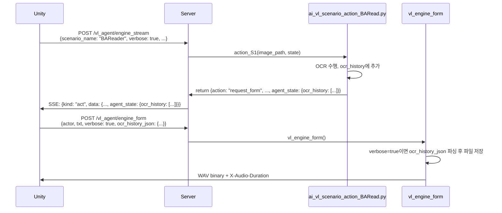

# OCR History Flow & Unity 연동 가이드

> **Unity 개발팀 전달용**: BAReader 시나리오에서 OCR 히스토리 수집 및 verbose 모드 로깅 구현 가이드

---

## 개요

BAReader 시나리오는 대사를 읽을 때마다 `ocr_history`에 누적 저장합니다. Unity에서 `verbose=true`로 설정하면 서버가 이 히스토리를 텍스트 파일로 저장합니다.

**저장 위치**: `./test/vl_agent/ocr_history_YYYYMMDD_HHMMSS.txt`

---

## 전체 플로우



---

## 관련 파일 목록

### 서버 측 (Python)

| 파일 | 역할 |
|------|------|
| `server_interface_vl_engine_impl.py` | `vl_engine_stream`, `vl_engine_form` 엔드포인트 구현 |
| `ai_vl_engine.py` | 메인 루프, verbose_mode 설정 |
| `ai_vl_scenario_action_BARead.py` | S1 액션: OCR 수행 및 ocr_history 누적 |
| `ai_vl_agent_types.py` | AgentEvent 구조 정의 |

### Unity 측 (구현 필요)

| 위치 | 역할 |
|------|------|
| `ApiVlAgentManager.cs` (추정) | engine_stream 호출 및 agent_state 저장 |
| `TTSManager.cs` (추정) | engine_form 호출 시 verbose, ocr_history_json 전송 |
| `DevManager.cs` | verbose 모드 플래그 관리 (F8 토글) |

---

## 1. engine_stream 흐름

### 1-1. Unity → Server Request

```http
POST /vl_agent/engine_stream
Content-Type: multipart/form-data

scenario_name=BAReader
verbose=true
screenshot=<image binary>
agent_state=<JSON string>
```

**파일 경로**: `server_interface_vl_engine_impl.py` → `vl_engine_stream()`

### 1-2. Server 내부 처리

**파일**: `ai_vl_scenario_action_BARead.py` → `action_S1()`

```python
# OCR 수행
ocr_data = classify_and_ocr(image_path)

# [처리 1] 중복 체크
if is_duplicate_ocr(state, ocr_data):
    return {'action': 'observe', ...}

# [처리 2] narration 체크
if ocr_data['dialogue_type'] == 'narration':
    # ocr_history에 추가
    ocr_history.append({
        'type': 'narration',
        'txt': ocr_data['txt']
    })
    return {'action': 'observe', ...}

# [처리 3] 일반 대사/선택지
ocr_history.append({
    'type': ocr_data['dialogue_type'],
    'actor': ocr_data['actor'],
    'txt': ocr_data['txt'],
    'choices': ocr_data['choices']  # 선택지만
})

return {
    'action': 'request_form',
    'x': click_x,
    'y': click_y,
    'voice_actor': ocr_data['actor'],
    'voice_txt': ocr_data['txt'],
    'ocr_history': ocr_history  # ← agent_state로 반환
}
```

### 1-3. Server → Unity Response

```json
{
  "kind": "act",
  "data": {
    "action": "request_form",
    "x": 1234,
    "y": 567,
    "voice_actor": "新素材開発部員A",
    "voice_txt": "やっ、アリス。",
    "dialogue_type": "dialogue_with_actor",
    "ocr_result": {...},
    "choices": null,
    "reason": "...",
    "agent_state": {
      "ocr_history": [
        {
          "type": "dialogue_with_actor",
          "actor": "新素材開発部員A",
          "txt": "やっ、アリス。"
        }
      ],
      "remain_retry_count": 5,
      "identify_fail_count": 0
    }
  }
}
```

**Unity 작업**: `agent_state` 저장 필수! (다음 호출 시 전달해야 함)

---

## 2. engine_form 흐름

### 2-1. Unity → Server Request

```http
POST /vl_agent/engine_form
Content-Type: multipart/form-data

actor=新素材開発部員A
txt=やっ、アリス。
lang=ja
speed=1.0
verbose=true                                    ← NEW!
ocr_history_json={"history":[{...}, {...}]}    ← NEW!
```

**ocr_history_json 구조**:
```json
{
  "history": [
    {
      "type": "dialogue_with_actor",
      "actor": "新素材開発部員A",
      "txt": "やっ、アリス。"
    },
    {
      "type": "dialogue",
      "actor": "アリス",
      "txt": "こんにちは。"
    },
    {
      "type": "choice",
      "actor": "プレイヤー",
      "txt": "やあ。",
      "choices": ["やあ。", "何してる？"]
    }
  ]
}
```

**Unity 구현 예시**:
```csharp
WWWForm form = new WWWForm();
form.AddField("actor", actor);
form.AddField("txt", txt);
form.AddField("lang", "ja");
form.AddField("speed", sound_speedMaster / 100f);

// verbose 파라미터
bool verbose = DevManager.Instance.IsDevModeEnabled();
form.AddField("verbose", verbose ? "true" : "false");

// ocr_history_json 파라미터
if (verbose && currentAgentState.ContainsKey("ocr_history"))
{
    var historyWrapper = new { history = currentAgentState["ocr_history"] };
    string json = JsonUtility.ToJson(historyWrapper);
    form.AddField("ocr_history_json", json);
}
```

### 2-2. Server 내부 처리

**파일**: `server_interface_vl_engine_impl.py` → `vl_engine_form()`

```python
# 파라미터 파싱
verbose = request.form.get('verbose', 'false').lower() == 'true'
ocr_history_json = request.form.get('ocr_history_json', '').strip()

# verbose 모드: ocr_history 로그 파일 저장
if verbose and ocr_history_json:
    import json
    history_data = json.loads(ocr_history_json)
    ocr_history = history_data.get('history', [])
    
    if ocr_history:
        log_dir = './test/vl_agent'
        timestamp = datetime.now().strftime('%Y%m%d_%H%M%S')
        log_path = os.path.join(log_dir, f'ocr_history_{timestamp}.txt')
        
        with open(log_path, 'w', encoding='utf-8') as f:
            f.write(f'=== OCR History Log ===\n')
            f.write(f'Generated: {datetime.now().strftime("%Y-%m-%d %H:%M:%S")}\n')
            f.write(f'Total Entries: {len(ocr_history)}\n')
            f.write('=' * 50 + '\n\n')
            
            for idx, entry in enumerate(ocr_history, 1):
                f.write(f'[{idx}] Type: {entry.get("type", "unknown")}\n')
                f.write(f'    Actor: {entry.get("actor", "")}\n')
                f.write(f'    Text: {entry.get("txt", "")}\n')
                if entry.get('choices'):
                    f.write(f'    Choices: {entry.get("choices")}\n')
                f.write('\n')
        
        print(f'  [VERBOSE] OCR history saved: {log_path}')

# 음성 합성 계속...
```

### 2-3. Server → Unity Response

```http
HTTP/1.1 200 OK
Content-Type: audio/wav
X-Audio-Duration: 0.88

<WAV binary data>
```

---

## 저장 파일 예시

**파일명**: `./test/vl_agent/ocr_history_20260215_220000.txt`

**내용**:
```
=== OCR History Log ===
Generated: 2026-02-15 22:00:00
Total Entries: 3
==================================================

[1] Type: dialogue_with_actor
    Actor: 新素材開発部員A
    Text: やっ、アリス。

[2] Type: dialogue
    Actor: アリス
    Text: こんにちは。

[3] Type: choice
    Actor: プレイヤー
    Text: やあ。
    Choices: ['やあ。', '何してる？']

```

---

## Unity 구현 체크리스트

### ✅ 필수 구현

1. **engine_stream 응답 처리**
   - [ ] `agent_state` 저장 (특히 `ocr_history`)
   - [ ] 다음 `engine_stream` 호출 시 `agent_state` 전달

2. **engine_form 요청 시**
   - [ ] `verbose` 파라미터 추가 (`DevManager.Instance.IsDevModeEnabled()`)
   - [ ] `ocr_history_json` 파라미터 추가 (`agent_state['ocr_history']`를 JSON 직렬화)

3. **DevManager 연동**
   - [ ] F8 토글 또는 설정 UI로 verbose 모드 활성화
   - [ ] `IsDevModeEnabled()` 메서드로 상태 반환

### ⚠️ 주의사항

- `ocr_history`는 **누적**됩니다. 시나리오 종료 시점에 리셋 필요
- `verbose=false`일 때는 `ocr_history_json` 전송 불필요 (성능 최적화)
- JSON 직렬화 시 `{"history": [...]}` 구조 유지 필수

---

## 디버깅 가이드

### 서버 로그 확인

```bash
# engine_form 호출 시 출력
[REQUEST PARAMS]
  actor: "新素材開発部員A"
  txt: "やっ、アリス。"
  lang: ja
  speed: 1.0
  verbose: True
  ocr_history_json: <provided>

[VERBOSE] OCR history saved: ./test/vl_agent/ocr_history_20260215_220000.txt
```

### 파일이 생성되지 않을 때

1. **verbose 파라미터 확인**: `"true"` 문자열로 전송되는지 확인
2. **ocr_history_json 확인**: 빈 문자열이 아닌지, 올바른 JSON인지 확인
3. **agent_state 저장 확인**: `engine_stream` 응답의 `agent_state`가 저장되고 있는지 확인
4. **서버 로그 확인**: `[VERBOSE]` 태그로 로그 검색

---

## 참고 자료

- [to_unity2.md](to_unity2.md): Phase 1 Unity 연동 변경사항
- [plan2.md](plan2.md): BAReader 시나리오 전체 설계
